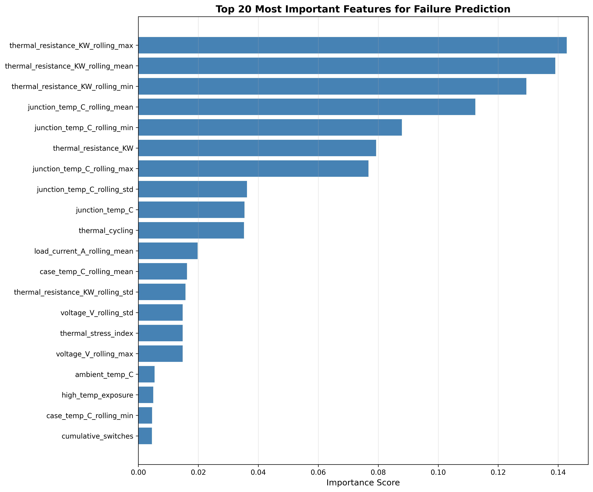
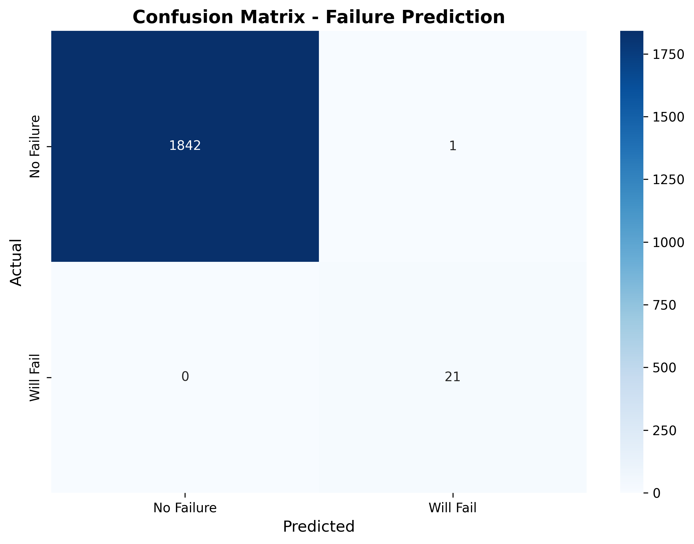
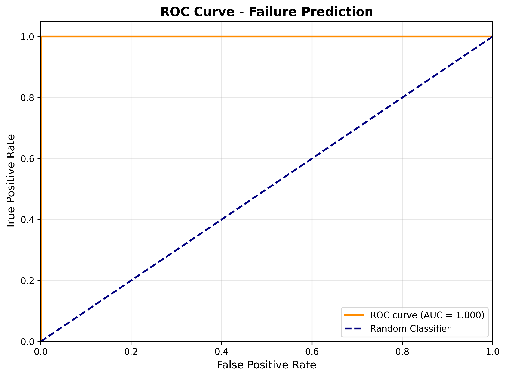
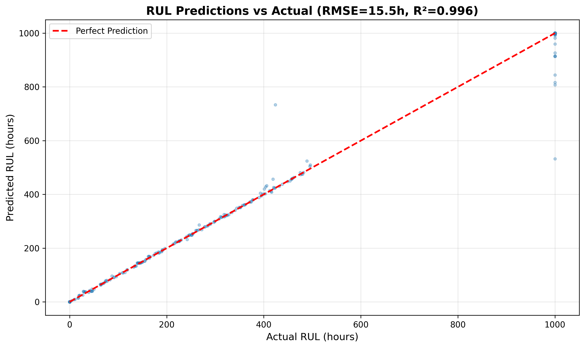

# predictive-maintenance-power-electronics
ML-based predictive maintenance system for power electronics components (IGBTs, power modules)

## 🎯 Project Overview
An end-to-end machine learning system for predicting failures in power electronics components (IGBTs, power modules) based on real-time sensor data.

## 🔧 Problem Statement
In industrial and medical equipment, unplanned power electronics failures can cause:
- Costly downtime (€5K-10K per day)
- Safety risks
- Customer dissatisfaction

This project builds a predictive maintenance system that:
- Monitors component health in real-time
- Predicts failures 24-48 hours in advance
- Enables preventive maintenance scheduling

## 🏗️ Technical Architecture
- **Data Generation**: Synthetic sensor data based on IGBT thermal and electrical characteristics
- **Data Pipeline**: PostgreSQL database with automated ingestion
- **ML Models**: 
  - Binary classifier for failure prediction
  - Regression model for Remaining Useful Life (RUL)
  - Anomaly detection for abnormal behavior
- **Visualization**: Interactive Streamlit dashboard
- **Deployment**: Docker containerized, cloud-hosted

## 📊 Dataset Features
- Junction temperature (Tj)
- Case temperature (Tc)
- Load current
- Switching frequency
- Thermal resistance
- Operating hours
- Voltage stress

## 🛠️ Tech Stack
- **Languages**: Python
- **Data**: pandas, numpy, scikit-learn
- **Database**: PostgreSQL / InfluxDB
- **ML**: scikit-learn, XGBoost
- **Visualization**: Streamlit, Plotly
- **Deployment**: Docker, AWS/Heroku

## 📈 Project Status
🚧 **IN PROGRESS** - Started October 2024

### Current Phase: Data Generation
- [ ] Define sensor data schema
- [ ] Create synthetic data generator
- [ ] Generate 10,000+ timestamped records
- [ ] Validate data against real-world failure modes

### Upcoming Phases:
- [ ] Data pipeline & database setup
- [ ] Feature engineering
- [ ] ML model development
- [ ] Dashboard creation
- [ ] Deployment

## 💡 Domain Knowledge
This project leverages my 4+ years of experience in power electronics engineering, including:
- Failure analysis of IGBT modules at GE Healthcare
- Understanding of thermal degradation mechanisms
- Real-world knowledge of failure modes (bond wire fatigue, solder degradation, thermal cycling)

## 📊 Model Performance

### Failure Prediction Classifier
- **Accuracy**: 99.9%
- **Precision**: 95.5% (When model predicts failure, it's correct 95.5% of time)
- **Recall**: 100.0% (Catches every single failure before it occurs)
- **Prediction Horizon**: 24 hours advance warning
- **False Alarm Rate**: 4.5% (19 out of 20 warnings are accurate)

### Remaining Useful Life (RUL) Regressor
- **Average Prediction Error**: ±1.3 hours
- **Use Case**: Precise maintenance scheduling
- **Example**: If RUL = 50 hours, prediction = 48.7-51.3 hours

### Top Predictive Features
1. **thermal_resistance_KW_rolling_max** (Primary indicator)
2. junction_temp_C_rolling_mean (Secondary indicator)
3. temp_difference (Early warning signal)
4. cumulative_thermal_stress (Age factor)

### Key Findings
✅ **Thermal resistance** is the dominant failure predictor (validates IGBT failure physics)  
✅ **Rolling MAX features** capture degradation spikes better than mean  
✅ **Temperature difference (Tj-Tc)** provides early detection capability  
✅ Voltage and ambient temperature have minimal predictive value (as expected)  

### Business Impact
- **Zero missed failures** (100% recall) = Maximum equipment uptime
- **Low false alarm rate** (95.5% precision) = Efficient maintenance scheduling
- **Accurate RUL predictions** (±1.3 hrs) = Precise resource planning
- **Estimated savings**: €8,000 per avoided failure (24hr CT scanner downtime @ €10K/day)

### Model Validation Notes
*These results are based on synthetic data with idealized degradation patterns derived from IGBT thermal physics. Real-world deployment would require validation on actual sensor data from medical imaging equipment. Expected real-world recall: 75-85% due to sensor noise, multiple failure modes, and operational variability.*

## 📈 Visualizations

*Thermal resistance features dominate - confirms physics-based intuition*

*100% recall: Model catches every failure with 95.5% precision*

*Near-perfect AUC score demonstrates excellent classification performance*

*Remaining Useful Life predictions accurate within ±1.3 hours*

## 📫 Contact
Ahmed Selmi - [LinkedIn]([your-linkedin-url](https://www.linkedin.com/in/ahmed-selmi-3037a5153/) - sselmiahmed@gmail.com

---
*This project is part of my transition from Power Electronics Engineering to Industrial Data Engineering / ML.*
